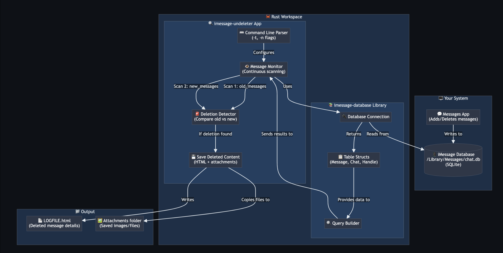
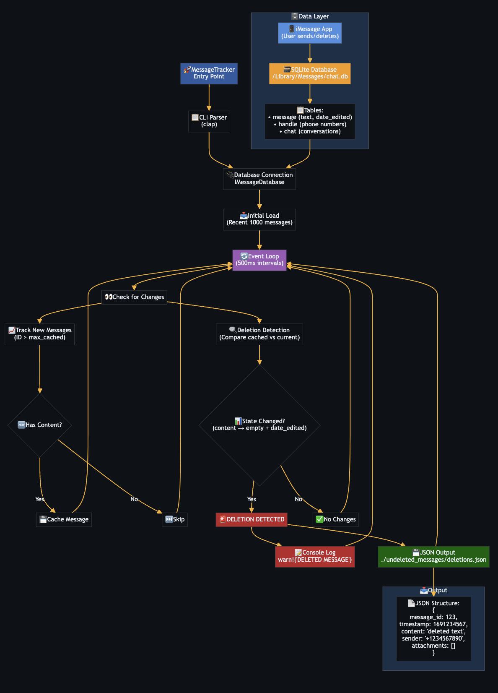

# 🕵️ iMessage EDA Tracker

Event-driven monitor that detects and preserves deleted iMessages

## 🎯 What It Does

Detects deleted/edited messages:

- 📱 **Message content** - Full text with formatting
- 🖼️ **Attachments** - Images, videos, files
- 👤 **Contact info** - Sender/receiver details
- ⏰ **Timestamps** - Send and deletion times

## 🏗️ How it works?

1. Monitors Apple's SQLite database (`/Library/Messages/chat.db`)
2. Uses WAL monitoring for real-time change detection
3. Processes events only when changes occur
4. Maintains state across app restarts
5. Outputs to JSON, SQLite, or terminal
6. Handles multiple events asynchronously


---



## 🚀 How to run?

### 1. Enable Full Disk Access (Required)

1. Open **System Settings** → **Privacy & Security** → **Full Disk Access**
2. Add your terminal application
3. Restart terminal

### 2. Verify Permissions

Test that permissions work:
```bash
ls -la /Users/$USER/Library/Messages/
```

❌ **Failure**: "Operation not permitted" - repeat step 1

### 3. Run the Monitor

Navigate to the tracker directory first:
```bash
cd imessage-tracker/imessage-undeleter
```

**Basic usage:**
```bash
# Start monitoring all conversations
cargo run

# Monitor specific contact with verbose logging
cargo run -- -t "+1234567890" -v

# Custom output location and check interval
cargo run -- -o ./my_deletions.json -i 500
```
